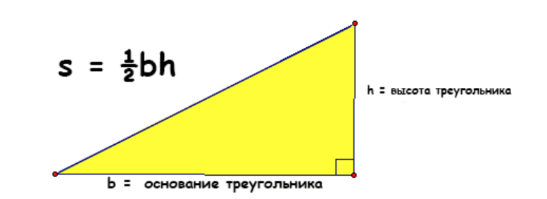

# School_tasks_beginning
Задачи для начала изучения.
1. Написать программу, которая будет считывать переменные с клавиатуры, складывать их и выводить результат.
2. Напишите программу, которая считывает длины двух катетов в прямоугольном треугольнике и выводит его площадь. Каждое число записано в отдельной строке.

3. Напишите программу, которая считывает целое число и выводит текст, аналогичный приведенному:  “Следующее число за числом 199 – 200. Предыдущее число за числом 199 – 198.”
4. * Написать функцию arithmetic, принимающую 3 аргумента: первые 2 – числа, третий – операция, которая должна быть произведена над ними. Если третий аргумент +, сложить их; если -, то вычесть; * — умножить; / — разделить (первое на второе). В остальных случаях вернуть строку "Неизвестная операция".
5. * Написать функцию is_year_leap, принимающую 1 аргумент — год, и возвращающую True, если год високосный, и False иначе. (Напомним, что в соответствии с григорианским календарем, год является високосным, если его номер кратен 4, но не кратен 100, а также если он кратен 400.)
6. Даны два целых числа. Выведите значение наименьшего из них.
7. Написать функцию season, принимающую 1 аргумент — номер месяца (от 1 до 12), и возвращающую время года, которому этот месяц принадлежит (зима, весна, лето или осень).
8. * Поиск простых чисел в заданном диапазоне; Напишите программу на Python, которая находит и выводит все простые числа в заданном пользователем диапазоне. Пользователь должен ввести начальное и конечное значения диапазона, и программа должна вывести все простые числа в этом интервале. Подсказка: Простые числа - это те, которые делятся только на 1 и сами себя без остатка. Используйте вложенные циклы для проверки деления каждого числа в заданном диапазоне.

